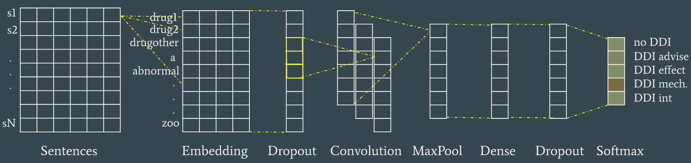

# Extraction of Drug-Drug Interactions from Biomedical Texts

Two common challenges in the field of Natural Language Processing applied to biomedical texts are the recognition and classification of Drug Name Entities and the detection and classification of Drug-Drug Interactions (DDI). A specific competition to solve these two problems was proposed in SemEval 2013 Task 9.

This work explains new models developed to approach these tasks, starting with baseline rule-based algorithms that are outperformed by later machine learning systems. A CRF model is used for Drug Name Entity recognition and classification. This model integrates features such as word shapes and clusters of word embeddings. A macro-average test F1-score of 0.74 is
obtained in the setting of the competition, significantly higher than the original winner system, that scored 0.64. 

An Ensemble of Deep Neural Networks is used to solve the DDI detection and classification task. The Ensemble is composed by 8 models that make individual predictions and vote to establish the final decision. These models include Convolutional Neural Networks, Recurrent Neural Networks and hybrid models. The Ensemble obtains a test F1-score of 0.63, only 2% lower than the winner of original task, that used Support Vector Machines.

| | |
|-|-|
| **Authors** | Albert Espín and Lavanya Mandadapu |
| **Date**  | February-May 2019  |
| **Report license**  | Creative Commons Attribution, Non-Commercial, Non-Derivative |

## Best Neural Architecture

The neural model in the image achieves 0.60 F1 for Task 9.2, and is part of the final ensemble that reaches 0.64 F1. See the report for more details on all the tested models, including the CRF model of Task 9.1.

